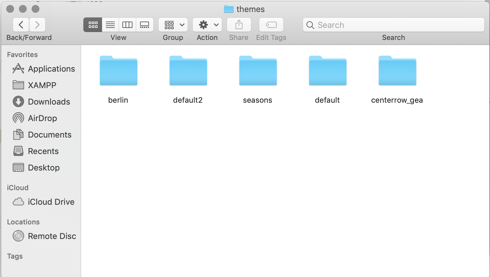

# Creating/Modifying Omeka theme
Technology required:
* HTML/CSS
* PHP  

Recommended: 
* SASS 
* JavaScript 
* git

## Getting started
1. Download and install a local installation of Omeka
1. Download and install XAMPP

## The Basics
1. In an essence, Omeka themes are PHP views that override the default application's PHP views.
    * All the PHP views defined in the application are listed under application/views.
1. Omeka uses PHP to interact with the database. This means you will not need to write any code for the database.
1. All PHP code defined by the Omeka application are located in the application/ directory. Do not modify the PHP code.
1. Themes are located under the themes/ directory. Each theme is its own subdirectory. Berlin, default2, seasons, default, and centerrow_gea are the themes installed in this example. Themes can be downloaded online, or created.
  

## Basic structure
The basic structure of an Omeka page consists of a header, body, and the footer. The header and footer views are defined under the common/ directory, and are included into a page with the functions `head()` and `foot()`

## Creating a theme
1. The easiest way to create a theme for Omeka is to download a basic theme like the default theme that ships with the application and tweak the code to fit your needs. 
1. While there are several PHP views you may want to consider overriding, the main files you may want to focus on are the following:
    ```
    common/
      header.php
      footer.php
    collections/
      browse.php
      show.php
    item/
      browse.php
      show.php
    index.php
    ```
1. You may also want to consider overriding views rendered by plugins. 
1. Once the PHP code has been rendered, it can be interacted with through JavaScript like any regular HTML page.


## Resources  
* Banner (PSD): https://unl.app.box.com/file/487181635936
* Omeka developer documentation: https://omeka.readthedocs.io/en/latest/